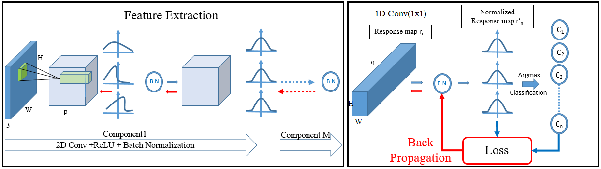

# DynamicSeg: Unsupervised Image Segmentation with Dynamic Weighted Loss Function

## Overview
DynamicSeg is an innovative unsupervised image segmentation framework leveraging dynamic weighted loss functions. Unlike traditional methods that require manual parameter adjustment, DynamicSeg automatically balances feature similarity and spatial continuity criteria, enhancing segmentation accuracy across diverse datasets. With its flexible and scalable architecture, DynamicSeg empowers researchers and practitioners to achieve state-of-the-art image segmentation results without the need for extensive manual annotations.



## Key Features
- **Dynamic Weighted Loss Function:** Automatically adjusts the balance between feature similarity and spatial continuity, ensuring flexible parameter updates.
- **Unsupervised Learning:** Segmentation without the need for extensive manual annotations.
- **Flexible and Scalable:** Adaptable to various datasets and image complexities.

## Methodology
The proposed dynamic weighting scheme prioritizes either feature similarity or spatial continuity criteria dynamically during training iterations, leading to a balanced segmentation. This dynamic approach eliminates the need for manual parameter tuning, enhancing segmentation accuracy across different datasets.

## Experimental Results
- **Quantitative Evaluation:** Outperforms existing unsupervised segmentation approaches on benchmark datasets.
- **Qualitative Assessment:** Produces semantically meaningful segmentation results, highlighting its efficacy in various application contexts.

## Usage
- **Training:** Use provided scripts to train the model on your dataset.
- **Evaluation:** Evaluate model performance using included evaluation tools.
- 
# Contributions
Contributions are welcome! Feel free to submit issues or pull requests.

# License
This project is licensed under the MIT License.

# Paper
[Link to the Paper](https://ieeexplore.ieee.org/abstract/document/9999089)

## Installation
```bash
git clone https://github.com/bijou-bijou/DynamicSeg.git
cd DynamicSeg
# Set up your environment and dependencies ```
